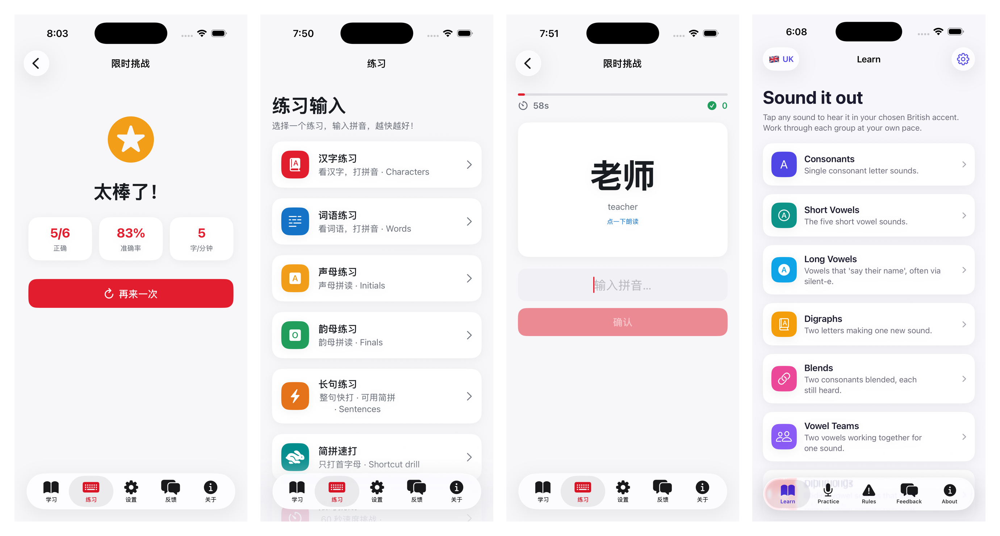

# 汉语拼音 · Hanyu Pinyin

A native iOS app for learning **Hanyu Pinyin** (Chinese romanization) and practicing fast
**pinyin input** — the way you actually type Chinese on a keyboard. Inspired by
[pinyinput.com](https://www.pinyinput.com/).



[](https://apps.apple.com/us/app/%E6%B1%89%E8%AF%AD%E6%8B%BC%E9%9F%B3-hanyu-pinyin/id6782562028)


## Features

- **学习 (Learn)** — the building blocks of pinyin, each with example characters and **tap-to-hear
  pronunciation**:
  - 声母 (23 initials), 韵母 (finals), 声调 (the four tones), how a 拼音输入法 works, and a
    快速输入技巧 (fast-typing tips) lesson.
- **练习 (Practice)** — typing sessions that show Chinese and ask you to type the pinyin
  (no tone marks needed, just like a real IME), with live feedback and **accuracy + 字/分钟** scoring:
  - 汉字 (characters), 词语 (words), 声母, 韵母, 长句 (sentences), 综合 (mixed).
  - **简拼速打** — a first-letter **shortcut drill** (type `wan` for 我爱你) for efficient input.
  - **长信息练习** — **long-message** drill (whole sentence or 简拼) for sustained fast typing.
  - **ü → v 练习** — the keyboard technique of typing **ü as `v`** (绿 → `lv`, 律师 → `lvshi`).
  - **限时挑战** — a **60-second speed challenge** with a live countdown and auto-advance.
- **设置 (Settings)** — choose a **female or male** Chinese voice for pronunciation.
- **反馈 (Feedback)** — send feedback straight to the team via WhatsApp.
- **关于 (About)** — app info, developer, and version.

Pronunciation uses the native `AVSpeechSynthesizer` (offline) with a Chinese voice.
White theme, Simplified-Chinese interface, iPhone, portrait.

## Tech stack

| Layer | Choice |
|-------|--------|
| UI | SwiftUI (`TabView`, `NavigationStack`) |
| Language | Swift 5 |
| Min OS | iOS 17 |
| Project gen | [XcodeGen](https://github.com/yonatankra/XcodeGen) (`project.yml`) |
| Theme | Single `Theme.swift` token file |

## Project structure

```
HanyuPinyin/
  HanyuPinyinApp.swift      app entry
  MainTabView.swift         bottom tab bar (学习 / 练习 / 设置 / 反馈 / 关于)
  Theme.swift               white-theme color tokens + card modifier
  PinyinData.swift          initials, finals, tones, characters, words, sentences
  Speaker.swift             AVSpeechSynthesizer wrapper (female/male zh voice)
  LearnView.swift           learn screens + fast-typing tips
  PracticeView.swift        session catalog + home
  PracticeSessionView.swift typing flow, timed challenge, scoring, results
  SettingsView.swift        voice (female/male) selection
  FeedbackView.swift        WhatsApp feedback form
  AboutView.swift           developer + version
project.yml                 XcodeGen config
```

## Build & run

```bash
brew install xcodegen          # one-time
xcodegen generate
open HanyuPinyin.xcodeproj
```

Or from the command line, onto the booted simulator:

```bash
xcodegen generate
xcodebuild -project HanyuPinyin.xcodeproj -scheme HanyuPinyin \
  -sdk iphonesimulator -destination 'platform=iOS Simulator,name=iPhone 17' build
```

## Acknowledgements

Concept reference: [pinyinput.com](https://www.pinyinput.com/).
Developed by [Tertiary Infotech Academy Pte Ltd](https://www.tertiaryinfotech.com).
